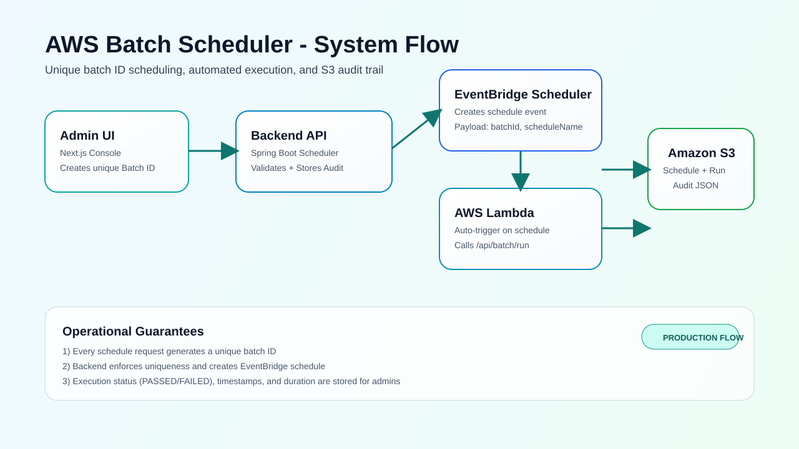
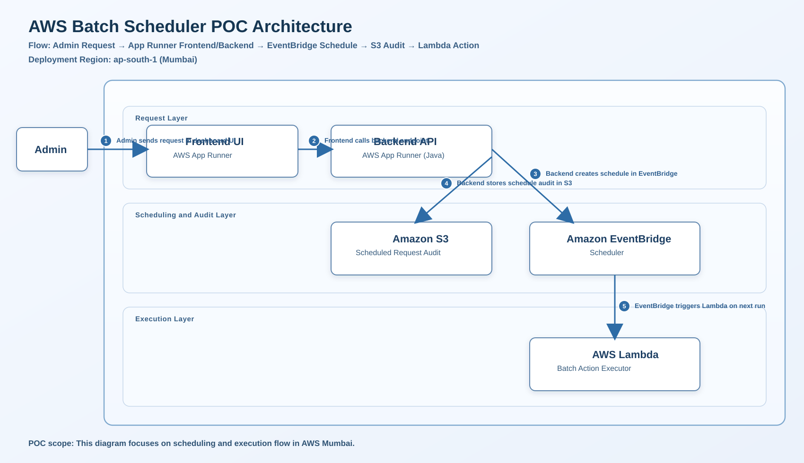
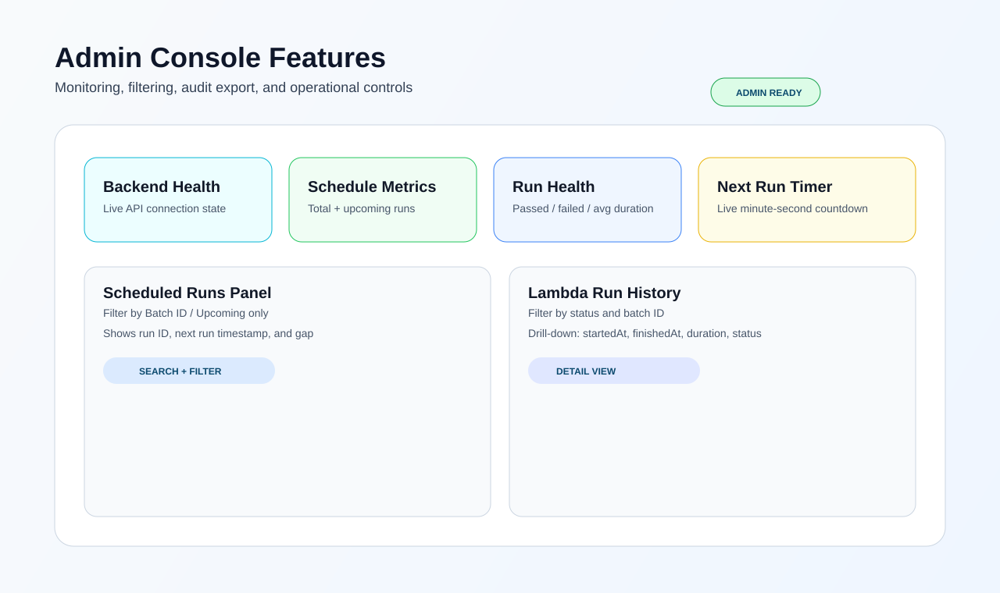

# AWS Batch Scheduler Platform (POC)
Enterprise batch scheduling platform with a professional admin dashboard, Spring Boot backend, EventBridge scheduling, Lambda execution, and S3 audit storage.



## AWS POC Architecture (Mumbai)
This POC architecture runs in `ap-south-1` and includes:
- Frontend on AWS App Runner
- Backend on AWS App Runner
- EventBridge Scheduler
- Lambda batch executor
- S3 for frontend assets and audit artifacts
- VPC controls for private connectivity



## Admin UI Highlights
- Responsive layout for mobile, tablet, and desktop
- Dark/light theme toggle
- Welcome popup + architecture modal
- Schedule creation with unique batch ID
- Next run countdown and health KPIs
- Run history filters and run export/copy actions



## Repository Structure
```text
apps/
  frontend/        # Next.js admin dashboard
  backend/         # Spring Boot 3 (Java 21) scheduler API
services/
  lambda/          # Lambda batch executor
infra/
  terraform/       # AWS infrastructure
```

## API Endpoints
### Scheduling
- `POST /api/batch/schedule`
- `GET /api/batch/schedules/recent?limit=10&upcomingOnly=true&batchId=ABC`

### Execution
- `POST /api/batch/run`
- `GET /api/batch/runs?limit=10&status=PASSED&batchId=ABC`

### Admin
- `GET /api/batch/admin/summary`
- `GET /actuator/health`

## Frontend to Backend API
- Frontend calls backend directly via:
  - `NEXT_PUBLIC_BACKEND_API_URL` (example: `https://smeiv3p6jn.ap-southeast-1.awsapprunner.com/api`)
- Optional rewrite support remains in `apps/frontend/next.config.mjs` via:
  - `BACKEND_INTERNAL_URL`

## Local Development
1. Install root dependencies:
```bash
npm install
```
2. Start backend:
```bash
npm run dev:backend
```
3. Start frontend:
```bash
npm run dev:frontend
```

Open:
- Frontend: `http://localhost:3000`
- Backend health: `http://localhost:8080/actuator/health`

## Environment Variables
### Frontend (`apps/frontend/.env.local`)
- `NEXT_PUBLIC_BACKEND_API_URL=https://smeiv3p6jn.ap-southeast-1.awsapprunner.com/api`
- `BACKEND_INTERNAL_URL=https://smeiv3p6jn.ap-southeast-1.awsapprunner.com` (optional)

### Backend
- `AWS_REGION`
- `LAMBDA_ARN`
- `SCHEDULER_ROLE_ARN`
- `AUDIT_BUCKET`
- `SCHEDULER_SECRET`
- `SCHEDULER_GROUP_NAME` (optional)
- `APP_CORS_ALLOWED_ORIGINS` (optional)

## Docker (No Compose)
### Frontend
```bash
docker build -t batch-frontend ./apps/frontend
docker run --rm -p 3000:3000 -e NEXT_PUBLIC_BACKEND_API_URL=https://smeiv3p6jn.ap-southeast-1.awsapprunner.com/api batch-frontend
```

### Backend
```bash
docker build -t batch-backend ./apps/backend
docker run --rm -p 8080:8080 -e SPRING_PROFILES_ACTIVE=prod -e AWS_REGION=ap-south-1 batch-backend
```

## Verify
```bash
npm run verify
```
